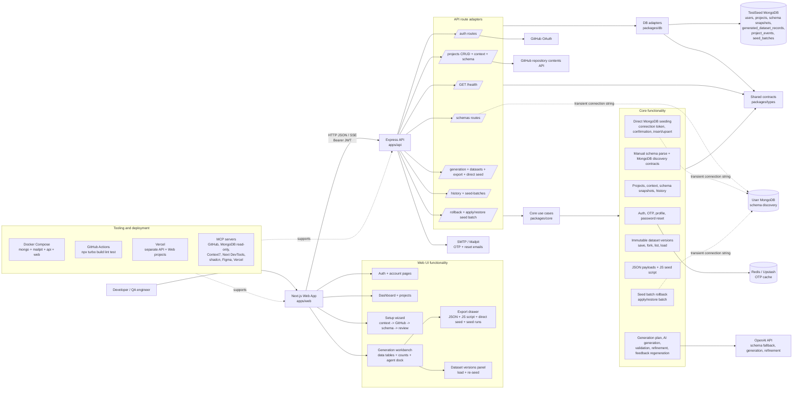

# TestSeed Architecture

TestSeed is organized as a clean-architecture monorepo. Dependencies point inward from UI and adapters toward stable contracts and use cases.

## Dependency Direction

Allowed package direction:

```text
packages/types -> packages/db -> packages/core -> apps/api -> apps/web
```

In practical terms:

- `packages/types` has no `@testseed/*` imports. It defines shared data contracts only.
- `packages/db` may import `@testseed/types`. It owns persistence models, cache adapters, and repository factories.
- `packages/core` may import `@testseed/types`. It owns business use cases and stays framework-free.
- `apps/api` may import `@testseed/types`, `@testseed/db`, and `@testseed/core`. It adapts HTTP requests to core use cases.
- `apps/web` may import `@testseed/types` only. It calls the API over HTTP and must not import backend packages.

## Directory Responsibilities

### `packages/types`

Shared TypeScript contracts used across the workspace.

- `src/auth.ts`: account, login, OTP, session, and user response contracts.
- `src/schema.ts`: parsed schema primitives plus schema parsing request/response contracts.
- `src/projects.ts`: project, schema snapshot, project event, seed batch, project CRUD, schema snapshot update/delete, history, and project-detail contracts.
- `src/api.ts`: compatibility re-exports only. New feature request/response contracts belong in their feature file, not in this mixed barrel.
- `src/index.ts`: public barrel export for consumers.

Feature contracts should be owned by the domain file that owns the vocabulary. When a feature exposes CRUD behavior, define the full surface up front or explicitly document unsupported operations. For projects, the supported lifecycle is create, list, read, update, archive delete, restore, and hard delete. For project schemas, the supported lifecycle is parse/create snapshot, read active snapshot, update active schema by saving a new snapshot, archive active snapshot, restore the latest archived snapshot, and hard delete active snapshot.

### `packages/core`

Framework-free application rules and use cases.

- `src/auth`: registration, login, GitHub login, logout, current user, password validation, and token creation.
- `src/schema`: manual schema parsing using local parsing first and AI fallback where configured.
- `src/projects`: project creation, project detail loading, schema snapshot persistence, project history, seed batch recording, rollback orchestration, and apply/restore seed batch behavior.
- `src/generation`: generation plans, OpenAI seed generation, validation, refinement, feedback regeneration, immutable dataset versions, export, and direct MongoDB seeding.

Core should receive dependencies as parameters. It should not import Express, Next.js, Mongoose, Redis, or environment variables.

### `packages/db`

Persistence and cache adapters.

- `src/models`: Mongoose model factories. Models are created from an injected connection to avoid module-level database singletons.
- `src/repositories`: repository factories that convert Mongoose documents into shared `@testseed/types` contracts.
- `src/cache`: Redis-backed cache adapters such as pending registration OTP storage.
- `src/connection.ts`: Mongoose connection factory.

### `apps/api`

Express HTTP adapter layer.

- `src/index.ts`: app composition, environment loading, repository wiring, and route mounting.
- `src/middleware`: request authentication and request-body validation.
- `src/routes`: thin route adapters that validate input, call core use cases, and return JSON.
- `src/email`: email delivery adapter for OTP messages.

Routes should stay thin. If behavior is not about HTTP, validation, or adapter wiring, it belongs in `packages/core` or `packages/db`.

### `apps/web`

Next.js frontend.

- `app`: application routes and page-level views.
- `components`: reusable UI, auth, branding, and shell components.
- `src/lib/api-client.ts`: browser-side HTTP client for the API.
- `src/lib/auth-session.ts` and `src/lib/auth-session.shared.ts`: local browser session storage, redirects, expiry handling, and pure shared session helpers.
- `src/lib/utils.ts`: UI utility helpers.

The web app should never import `@testseed/core` or `@testseed/db`; it should communicate with backend behavior through API endpoints.

### `docs`

Requirements, architecture notes, ADRs, and Superpowers planning artifacts.

- `docs/requirements.md`: source of product requirements.
- `docs/adr`: durable architecture decisions.
- `docs/superpowers`: implementation plans, specs, and workflow notes.
- `docs/ai-assisted-tooling.md`: living inventory of MCPs, skills, Spec Kit, and agent workflows (keep updated).

## Current Separation Notes

- Project history is split across shared contracts, db repositories, core use cases, API routes, and dashboard/project pages.
- Sensitive MongoDB connection strings are passed through request-time adapter code and are not persisted.
- Active project schema snapshots are stored separately from project metadata so project list loading stays lightweight.
- Archive deletes preserve project/history records through `archivedAt`; restore clears `archivedAt` and returns the item to active navigation; hard deletes remove project-owned records and must be explicit in the API/UI.
- The main shell includes a dedicated projects pane at `/projects`. Dashboard pages should summarize workspace state, while project lifecycle actions live on `/projects` and `/projects/[projectId]`.

## Current System Architecture Diagram

This diagram reflects the implemented system: Next.js web UI, Express API, clean architecture packages, TestSeed application MongoDB, transient user MongoDB access, OpenAI, GitHub OAuth/context, Redis OTP cache, SMTP email, and deployment/tooling surfaces.



## Architecture Diagram Generation Prompt

Use this prompt in Lucidchart, Figma/FigJam, Mermaid-capable tools, or another diagram generator when a manually polished diagram is needed:

```text
Create a clean architecture diagram for TestSeed, an AI-powered MongoDB seed data generator.

Show these actors and systems:
- Developer / QA user in a browser.
- Next.js 14 React web app in apps/web.
- Express 4 API in apps/api.
- Shared packages: packages/types, packages/db, packages/core.
- TestSeed application MongoDB storing users, projects, schema snapshots, generated dataset versions, project events, and seed batches.
- User-provided MongoDB database used only through transient request-time connections for schema discovery, direct seeding, rollback, apply seed batch, and restore seed batch.
- OpenAI API used for schema fallback, seed generation, streamed generation, refinement chat, and feedback regeneration.
- GitHub OAuth and GitHub repository contents API for login and optional repository context.
- Redis / Upstash for OTP cache.
- SMTP / Mailpit for registration OTP, password reset, and email-change verification.
- Tooling/deployment: Docker Compose local stack, GitHub Actions CI, Vercel API project, Vercel web project, and MCP tooling.

Show the major user-facing feature flows:
1. Account management: register/login/GitHub OAuth/profile/password reset/delete account.
2. Project context setup: create project, description, optional GitHub repository context.
3. Schema input: manual Mongoose parse or MongoDB discovery, then schema review and snapshot save.
4. Generation workbench: collection counts, generation plan, AI generation, streamed progress, table preview.
5. Refinement and regeneration: chat refinement, feedback regeneration, candidate accept/reject.
6. Dataset versions: every generation/refinement/manual save creates or forks a generated dataset version; users can load and re-seed versions.
7. Export: JSON export and JavaScript seed script export.
8. Direct MongoDB seeding: connection test, confirmation summary, insert/upsert records tagged with seedBatchId.
9. History and rollback: project events, seed batch list, rollback by seedBatchId, apply/restore seed batch.

Emphasize architecture boundaries:
- apps/web imports only packages/types and calls apps/api over HTTP/SSE.
- apps/api is a thin adapter that validates requests, authenticates JWTs, wires dependencies, and calls packages/core.
- packages/core contains business use cases and receives dependencies by injection.
- packages/db owns Mongoose models, repositories, Redis cache adapters, and MongoDB connection factories.
- packages/types owns shared contracts.

Add security callouts:
- User MongoDB connection strings are transient and are never stored, logged, or returned.
- MongoDB rollback deletes only documents tagged with the requested seedBatchId.
- AI output is validated before save, export, or direct seed.
- Project data is scoped by authenticated ownerId.

Layout suggestion:
- User and Web on the left.
- API route adapters in the center.
- Core packages and business use cases below/inside the center.
- TestSeed MongoDB, Redis, SMTP, GitHub, OpenAI, and User MongoDB on the right.
- Tooling/deployment as a bottom band.
- Use solid arrows for normal HTTP/package calls, dotted arrows for transient user MongoDB operations, and a highlighted note for connection string safety.
```

## Testing Convention

Each feature keeps tests in a feature-owned `__tests__` directory:

- `packages/core/src/auth/__tests__`
- `packages/core/src/schema/__tests__`
- `packages/core/src/projects/__tests__`
- `packages/types/src/__tests__`
- `packages/db/src/repositories/__tests__`
- `apps/api/src/routes/__tests__`

Use `npm run test:suite` from the repository root to run the full build, lint, and test suite through Turbo. `npm test` runs every package-level `test` task, and every workspace package defines one so new failures are not skipped silently.

Core behavior tests use Jest. Type, db, API, and web tests currently use their package type/lint checks as contract tests until those layers need deeper behavioral test harnesses.
