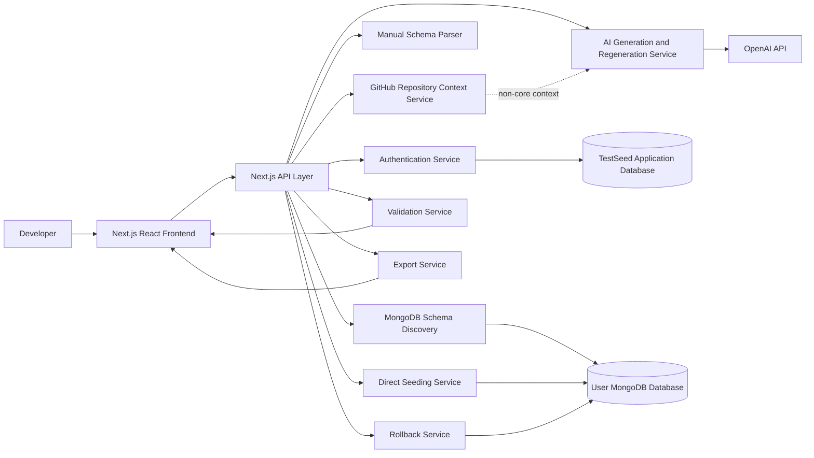

# TestSeed: Requirements and Design Documentation

## 1. Project Overview

TestSeed is a web application that helps developers generate realistic test data for MongoDB applications. The project addresses a common development problem: teams often need database seed data before they can build, test, or demo their applications, but creating that data manually is slow, repetitive, and easy to get wrong. This becomes especially frustrating when a database contains multiple related collections, required fields, enum values, unique constraints, and ObjectId references. TestSeed is designed for backend developers, full-stack developers, QA engineers, student software teams, and instructors who need realistic MongoDB data without repeatedly writing manual seed scripts.

The project has evolved from the original Assignment 1 proposal in three important ways. First, TestSeed now requires users to create an account and log in before using the application. This makes it possible to associate generation sessions, seed batches, and rollback actions with a specific user instead of treating every operation as anonymous. Second, TestSeed will support two schema input modes. Users may paste their Mongoose schema directly, or they may connect to a MongoDB database so the application can inspect existing collections and infer schema information automatically. This makes the tool useful both for teams with code-defined Mongoose models and for teams that already have a database with sample documents. Third, regeneration is now designed as an iterative feedback loop rather than a simple "run again" action. After reviewing generated records, users can make direct edits or add comments such as "make users Canadian" or "generate more varied product prices." The next generation will use the previous output plus the user's comments to produce a more useful dataset.

The updated main user flow is: the user creates an account or logs in, enters a short project description, chooses either manual schema input or MongoDB schema discovery, optionally provides a GitHub repository link for additional project context, selects record counts per collection, generates realistic relational seed data, previews the generated records, edits values or adds feedback comments, regenerates if needed, and then exports the final dataset or inserts it directly into MongoDB. When records are inserted directly, TestSeed tags them with a `seedBatchId` so the user can view an insertion report and roll back that batch later.

**Generation UX (shipped):** New projects use a **setup wizard** (project context → optional GitHub → schema input → review). After the schema is saved, users open the **Generation Workbench** for counts, generation, table preview, saved runs, and streamed AI refinement chat. Returning users with a saved schema can open the workbench directly (`?mode=generate`). Each successful generation or refinement creates a **saved run** that persists collection counts, generated records, and refinement chat history for later preview. See `docs/ui-design.md` § Generate Flow and `docs/generation-ux-roadmap.md`.

**Projects list UI (shipped):** The projects page uses page sections, labeled filter groups, Cards/List/Compact view modes (preference in `localStorage`), bordered list containers with row dividers, and clickable project items with separate action buttons. See `docs/ui-design.md` § Projects List.

## 2. Requirements

### 2.1 Core and Non-Core Requirements

The core functionality of TestSeed is organized into eleven epics: Account Management, Project Context Setup, Manual Schema Input, MongoDB Schema Discovery, AI Seed Generation, Feedback-Based Regeneration, Preview and Editing, Export, Direct MongoDB Seeding, Rollback, and Validation and Error Handling. These epics represent the minimum product needed for TestSeed to solve the main problem described in the proposal. Non-core functionality includes connecting to a remote GitHub repository to fetch repository files for additional project context, saved example schemas, team workspaces, support for SQL databases, support for Prisma or Sequelize, and long-term seed history. These features may be useful in later versions, but they are outside the scope of the minimum course project.

### 2.2 User Stories, Acceptance Criteria, and Alternative Flows

| Epic | User Story | Acceptance Criteria | Alternative Flows |
| --- | --- | --- | --- |
| Account Management | As a developer, I want to create an account so my generation sessions and seed batches are tied to my identity. | The user can register with basic account credentials. The system creates a user profile. The user can proceed to the main workflow only after registration or login. | If the email is already used or required fields are missing, the system shows a clear error and asks the user to correct the form. |
| Account Management | As a developer, I want to log in to my account so I can securely access my TestSeed workspace. | The user can log in with valid credentials. The system starts an authenticated session. Protected pages such as generation, direct seeding, and rollback require login. | If credentials are invalid, the system denies access and shows a generic login error without revealing which field was wrong. |
| Project Context Setup | As a developer, I want to enter a project description so generated data matches my application domain. | The user can enter a plain-language description. The system includes the description in the generation request. Generated values reflect the described domain where possible. | If the description is empty, the system still allows generation but warns that results may be generic. |
| Manual Schema Input | As a developer, I want to paste Mongoose schemas so I can generate data from code-defined models. | The user can paste one or more Mongoose schemas. The system extracts collections, fields, types, required fields, enum values, validators, unique fields, and references. The user sees a schema review before generation. | If the schema is invalid or unsupported, the system explains the issue and asks the user to revise the input. |
| MongoDB Schema Discovery | As a developer, I want to connect to MongoDB and retrieve schema information automatically so I do not need to paste schemas manually. | The user can enter a MongoDB connection string. The system tests the connection. The system inspects collections and sample documents to infer field names, likely types, nested objects, arrays, and possible references. | If the connection string is invalid, the system shows a connection error. If no collections are found, the system asks the user to paste a schema manually. If documents are sparse or inconsistent, the system marks inferred fields as uncertain. |
| Schema Review | As a developer, I want the app to detect collections, fields, likely types, enum-like patterns, and references so generated data fits my database. | The system displays detected collections and fields. The user can review inferred types and warnings. References are highlighted when ObjectId-like fields or naming patterns suggest relationships. | If inference confidence is low, the system warns the user and allows generation to continue with conservative assumptions. |
| AI Seed Generation | As a developer, I want realistic records generated in dependency order so ObjectId references are valid. | Parent collections are generated before child collections. Generated values respect field types, enum values, required fields, and references. The system returns valid JSON records grouped by collection. | If the AI returns malformed JSON, the backend retries with a correction prompt. If generated records fail validation, the invalid batch is regenerated or shown with clear validation errors. |
| AI Seed Generation | As a developer, I want to chat with the AI about specific generated values so I can refine seed data without manually editing every record. | The generated dataset screen includes an AI refinement chat box. Accepted refinements return valid JSON grouped by collection and preserve schema constraints and ObjectId references. Rejected refinements leave the current valid dataset unchanged. | If the chat request conflicts with required fields, enum values, unique fields, types, or references, the system explains the issue and does not replace the current valid dataset. If the user asks a question rather than requesting a change, the system can return guidance without mutating records. |
| Record Counts | As a developer, I want to choose record counts per collection so I can control dataset size. | The user can set record counts for each collection. The system displays the expected total number of generated records. Generation uses the selected counts. | If a requested count is too large, the system recommends batching or asks the user to reduce the count. |
| Preview and Editing | As a developer, I want to preview generated records before using them. | **Shipped (006):** Generated records appear in per-collection tables in the workbench. The user can inspect field values, ObjectId references, and validation status. Saved runs restore preview state. | If a collection has no generated records, the system shows an empty state and allows the user to regenerate. |
| Preview and Editing | As a developer, I want to make direct edits to generated records. | **Planned (007):** The user can edit table cells before export or insertion. The system revalidates edited records. Invalid edits are highlighted. | If an edit violates a type, enum, required field, or uniqueness rule, the system prevents final export or insertion until the issue is fixed. |
| Feedback-Based Regeneration | As a developer, I want to add comments so the next generation improves based on my feedback. | The preview screen includes a feedback box. The user can submit instructions such as "use Canadian addresses" or "make prices more varied." The system sends the previous output and the new comments to the AI service. | If feedback conflicts with schema constraints, the system keeps the schema valid and explains that the request could only be partially applied. |
| Feedback-Based Regeneration | As a developer, I want regeneration to consider the previous generated data plus my comments so I can iteratively refine results instead of starting over. | Regenerated records preserve useful structure from the previous result where appropriate. The system applies user comments to the next version. The user can compare or review the updated result before accepting it. | If regeneration creates duplicate unique values or invalid references, the system flags the problem and retries or asks the user to revise the feedback. |
| Export | As a developer, I want to export generated data as JSON so I can use it manually. | The user can download or copy JSON grouped by collection. The JSON includes valid records and references. | If records are invalid, the system blocks export and shows validation errors. |
| Export | As a developer, I want to export a JavaScript seed script so I can run it in a local or CI environment. | The user can generate a ready-to-run seed script. The script inserts records in dependency order. The script includes comments explaining required environment variables or connection setup. | If the dataset contains unresolved references, the script is not generated until the issue is fixed. |
| Direct MongoDB Seeding | As a developer, I want to test a MongoDB connection before inserting data. | The user can test the connection string. The system reports success or failure. The connection string is used for the operation only and is not stored. | If the connection fails, direct seeding remains disabled until the user provides a working connection string. |
| Direct MongoDB Seeding | As a developer, I want to confirm before direct seeding. | Before insertion, the system shows a confirmation screen with target database, collections, record counts, and a warning that records will be inserted. The user must explicitly confirm. | If the user cancels, no records are inserted. |
| Direct MongoDB Seeding | As a developer, I want inserted records tagged with a `seedBatchId`. | Every inserted record receives the same `seedBatchId` for that operation. The insertion report shows collection counts and the batch ID. | If insertion partially fails, the system reports which collections succeeded and which failed, then offers rollback for inserted records. |
| Rollback | As a developer, I want to rollback a seed batch. | The user can select or enter a `seedBatchId`. The system deletes records from the batch and reports deleted counts by collection. | If the batch ID is missing, invalid, or already rolled back, the system shows an error and does not delete unrelated data. |
| GitHub Repository Context | As a developer, I want to connect a remote GitHub repository so TestSeed can fetch repository files for additional context. | In a future version, the user can provide or authorize access to a GitHub repository. The system reads relevant project files such as schemas, models, seed scripts, and README documentation to improve generation context. | If the repository is private, unavailable, too large, or does not contain useful schema files, the system explains the limitation and continues with manual schema input or MongoDB discovery. |

## 3. System Design

TestSeed uses a three-tier web architecture. The presentation layer is a Next.js and React frontend that handles account registration, login, schema input, MongoDB connection setup, schema review, generation controls, preview tables, feedback comments, export options, direct seeding confirmation, insertion reports, and rollback. The backend/API layer contains the application logic for authentication, parsing manual schemas, discovering database structure from MongoDB, creating AI prompts, validating generated records, exporting data, inserting records, and rolling back seed batches. The data layer includes TestSeed's application database for user accounts and session metadata, plus the user's MongoDB database, which is accessed only when the user chooses schema discovery, direct seeding, or rollback.

The OpenAI API is used as an external AI service. It receives structured prompts containing the project description, schema information, requested record counts, previous generated output when available, and user feedback comments. The AI returns generated records or revised records, and the backend validates this output before displaying it to the user. Validation is important because AI output may be malformed, incomplete, or inconsistent with schema constraints. The application should treat AI output as a draft that must pass validation before export or insertion.

Security is a major design constraint. MongoDB connection strings are sensitive, so TestSeed should use them only for the active operation and should not store them. When a user connects to MongoDB for schema discovery, the backend temporarily connects, inspects collection names and sample document structure, then closes the connection. When a user performs direct seeding, the backend connects temporarily, inserts records after confirmation, tags them with a `seedBatchId`, reports the result, and closes the connection.

### 3.1 Architecture Diagram Content for Lucidchart

The architecture diagram should contain these nodes:

- Frontend: Next.js React UI
- Backend/API Layer: Next.js API routes
- Authentication Service
- Manual Schema Parser
- MongoDB Schema Discovery Service
- GitHub Repository Context Service (non-core)
- AI Generation Service
- Validation Service
- Export Service
- Direct Seeding Service
- Rollback Service
- OpenAI API
- TestSeed Application Database
- User MongoDB Database

Suggested Lucidchart layout: place the frontend on the left, backend services in the center, OpenAI API on the upper right, TestSeed's application database near the authentication service, and the user's MongoDB database on the lower right. Add a security note beside the MongoDB connection flow: "Connection strings are used temporarily and not stored."



### 3.2 Main Data Flow

The main data flow begins when the user creates an account or logs in. After authentication, the user provides a project description and chooses a schema input method. If the user pastes a Mongoose schema, the backend parses it directly. If the user connects to MongoDB, the backend temporarily connects to the database, inspects collections and sample documents, infers likely schema information, and closes the connection. As a non-core future feature, the user may also connect a remote GitHub repository so TestSeed can fetch relevant files for additional context. The user then reviews the detected structure and chooses record counts per collection.

The backend sends the project description, schema structure, and record counts to the AI generation service. The AI returns generated records grouped by collection. The backend validates the records and returns them to the frontend for preview. If the user uses the AI refinement chat box, the backend sends the previous generated records, schema structure, validation context, and the user's message to the AI service so it can revise the data or answer with non-mutating guidance. Every refined dataset is revalidated before it can replace the current valid dataset. Once the user is satisfied, the final dataset can be exported as JSON, exported as a JavaScript seed script, or inserted directly into MongoDB after confirmation. Directly inserted records receive a `seedBatchId`, which allows the user to roll back the batch later.

## 4. UI / UX Design

The user interface should be designed around the developer's workflow: create an account or log in, provide context, identify schema, generate records, review output, refine output, and then use the final data. Figma AI can be used to create initial wireframes, but the final screens should be reviewed by the team to ensure they match the requirements.

### 4.1 Required Screens

1. **Account Creation and Login Screen:** This screen allows a new user to create an account and an existing user to log in. The screen should be simple and should communicate that generation sessions, seed batches, and rollback actions belong to the logged-in user.

2. **Start Screen:** This screen contains the TestSeed title, a project description field, two core schema input choices, and one non-core repository context option. The core choices are paste a Mongoose schema or connect to MongoDB. The non-core option is to connect a remote GitHub repository so TestSeed can fetch project files for additional context.

3. **MongoDB Connection and Schema Discovery Screen:** This screen contains a connection string field, a "Test Connection" action, and a list of discovered collections after connection succeeds. It should also show a note that the connection string is used only for the current operation and is not stored.

4. **Schema Review Screen:** This screen shows detected collections, fields, likely types, required-looking fields, enum-like values, references, and warnings. For MongoDB-discovered schemas, uncertain fields should be marked clearly because the structure is inferred from sample documents rather than retrieved from a formal schema.

5. **Preview and Edit Screen:** This screen shows generated records in per-collection tables. Users can inspect values, edit cells, and see validation warnings. References should be readable enough for users to confirm that related records connect correctly.

6. **AI Refinement Chat Screen:** This screen places a chat box beside or below the generated dataset preview. Example messages may include "make users Canadian," "create more realistic product names," or "make order totals match item prices." The refinement action should clearly indicate that the previous output and the user's message will both be considered, and invalid refinements will not replace the current valid dataset.

7. **Export and Seed Options Screen:** This screen lets users export JSON, export a JavaScript seed script, or directly seed MongoDB. Direct seeding should require a successful connection test and should lead to a confirmation step before insertion.

8. **Insertion Report and Rollback Screen:** This screen shows inserted counts by collection, the `seedBatchId`, any insertion errors, and a rollback action. If rollback is performed, the screen should show deleted counts by collection.

### 4.2 Figma AI Prompt

Use this prompt in Figma AI to generate the first wireframe set:

```text
Create a clean developer-focused web app UI for TestSeed, an AI-powered MongoDB seed data generator. The app should feel like a practical developer tool, not a marketing site. Include screens for: account creation and login, project description and schema input choice, optional GitHub repository context, MongoDB connection and schema discovery, schema review with collections and inferred fields, generated data preview with editable tables, feedback-based regeneration with a comment box, export/direct seed options, and insertion report with rollback by seedBatchId. Use a simple dashboard layout, clear tables, validation warnings, and restrained colors.
```

## 5. Technology Stack

TestSeed will use Next.js with React for the web interface and API routes. This fits the project because the application needs a browser-based interface, form-heavy workflows, preview tables, and backend endpoints for authentication, generation, validation, export, seeding, and rollback. Tailwind CSS will support fast UI development with consistent styling for forms, tables, modals, and dashboard screens. TypeScript will make the project safer by defining structures for users, schemas, inferred fields, seed plans, generated records, validation errors, and API responses.

MongoDB is the target database because the project focuses on MongoDB and Mongoose applications. Mongoose will be used as the validation model for manually pasted schemas and generated records where possible. A small TestSeed application database will store user accounts and metadata needed to associate sessions and seed batches with logged-in users. The OpenAI API will support AI-assisted schema interpretation, initial seed generation, and feedback-based regeneration. Lucidchart will be used for the architecture diagram, and Figma AI will be used to create wireframes for the required UI screens. GitHub will support version control, pull requests, and team collaboration. In a later non-core feature, GitHub repository access may also be used to fetch project files for additional generation context. Vercel can be used for deployment.

This stack is also practical for an AI-assisted software engineering course because Next.js, React, TypeScript, Tailwind CSS, MongoDB, and Mongoose are common technologies with strong documentation and broad AI tool support. Tools such as ChatGPT, GitHub Copilot, Cursor, and Figma AI can help generate drafts, code, tests, UI ideas, and documentation, but their outputs still need human review.

## 6. Use of AI in Requirements and Design

AI was used to help convert the original TestSeed proposal into a structured requirements and design document. The proposal described the main problem and solution, but Assignment 2 required a more detailed explanation of user interactions, acceptance criteria, alternative flows, system architecture, UI screens, and technology choices. AI helped reorganize the proposal into epics such as Account Management, Project Context Setup, Manual Schema Input, MongoDB Schema Discovery, AI Seed Generation, Feedback-Based Regeneration, Preview and Editing, Export, Direct MongoDB Seeding, Rollback, and Validation and Error Handling. This made the requirements easier to connect to the grading rubric and easier to turn into implementation tasks later.

AI was especially useful for expanding the user stories. Starting from the main developer workflow, AI helped identify the actions users need to perform and the goals behind those actions. For example, the requirements were expanded to include account creation and login as core functionality, since generation sessions, direct seeding, and rollback are safer and easier to manage when tied to a specific user. AI also helped identify GitHub repository context as a useful non-core enhancement. In a future version, connecting to a remote repository could allow TestSeed to read schema files, model definitions, seed scripts, and README documentation for better generation context. Human review was needed to keep this GitHub feature non-core so the main course project remains feasible.

AI also suggested that schema input should not be limited to pasted Mongoose code. A developer might already have a MongoDB database with collections and sample documents, so TestSeed should also allow MongoDB schema discovery. This addition improves usability because it reduces manual input for users who want the app to inspect their database directly. However, human review was needed to define the limitation clearly: MongoDB does not always expose a formal schema, so TestSeed can infer structure from collections and sample documents, but those inferences may be uncertain.

AI also helped refine the regeneration feature. A basic regeneration feature would simply run the same prompt again and produce a different dataset. That behavior is useful, but it does not support an iterative workflow. The stronger design allows the user to add comments after seeing the generated data, and the next generation uses both the previous output and the user's comments. This better matches how developers work: they review generated data, notice what feels unrealistic or missing, and ask for targeted improvements. Human judgment was needed to keep this feature grounded in schema constraints. If a user asks for something that conflicts with required fields, enum values, or reference rules, the system should preserve validity and explain that the request could only be partially applied.

AI was also used to brainstorm alternative flows and edge cases. These included invalid manual schemas, failed MongoDB connections, empty databases, inconsistent sample documents, malformed AI JSON, validation failures, duplicate unique values, partial insertion failures, and invalid rollback batch IDs. This was one of the most valuable uses of AI because edge cases are easy to overlook when focusing only on the happy path. The team still needs to validate these suggestions against the final implementation timeline and decide which error messages and safeguards are essential for the course demo.

For system design, AI helped compare possible architectures and settle on a three-tier web application with a frontend, backend/API layer, and database layer. It also highlighted the need for a security boundary around MongoDB connection strings. Since connection strings are sensitive, the final design states that they are used temporarily for schema discovery, direct seeding, or rollback, and are not stored. This is an example where AI-generated design ideas were useful but required careful human review, because careless handling of credentials would create a serious security problem.

For UI/UX design, AI can assist through Figma AI by generating first-pass wireframes for the major screens. The team can use AI-generated mockups for account creation and login, the start screen, MongoDB connection flow, optional GitHub repository context, schema review, generated data preview, feedback regeneration, export/direct seed options, and insertion report with rollback. These AI-generated designs should be treated as drafts. The team should review them to ensure that the interface supports the real developer workflow, keeps safety confirmations visible, and does not make risky actions such as direct database insertion too easy to trigger accidentally.

Overall, AI was most useful for organizing the requirements, identifying edge cases, generating user stories, and proposing UI and architecture ideas. Its main limitation was that it could easily expand the project beyond the available time. Human review was necessary to keep the project focused on MongoDB/Mongoose, include account creation and login as a core safety requirement, keep GitHub repository context as non-core, exclude SQL support, and make direct seeding and rollback ambitious but still feasible for the course timeline.

## 7. Assumptions and Scope

TestSeed is focused on MongoDB and Mongoose for this version. Account creation and login are in scope as core functionality, but team workspaces, role-based collaboration, SQL databases, Prisma, Sequelize, long-term seed history, and multi-tenant organization management are outside the scope of this course project. Manual Mongoose schema input remains available because some databases may be empty or may not contain enough sample documents for reliable schema discovery. MongoDB schema discovery is based on inspecting existing collections and sample documents, so it may infer structure rather than retrieve a formal schema. Connecting to a remote GitHub repository for additional project context is included as a non-core future feature rather than a required MVP feature.

Feedback-based regeneration is considered a core requirement. The application should not merely run the same generation prompt again; it should use the previous generated output plus user comments to refine the data. Direct seeding and rollback are also core requirements. Connection strings are used only during the active operation and are not stored.

## 8. Submission Checklist

- Updated project overview is included.
- Core and non-core scope are identified.
- Account creation and login are listed as core requirements.
- GitHub repository context is listed as non-core functionality.
- User stories are grouped by epic.
- Acceptance criteria are included.
- Alternative flows and edge cases are included.
- High-level system architecture is described.
- Lucidchart diagram content is specified.
- At least five UI screens are planned.
- Figma AI prompt is included.
- Technology stack is explained.
- AI usage reflection is at least one page of content.
- Sensitive MongoDB connection handling is addressed.
- The document can be formatted in Arial or equivalent, 12 pt, single-spaced, within 3-5 pages.
